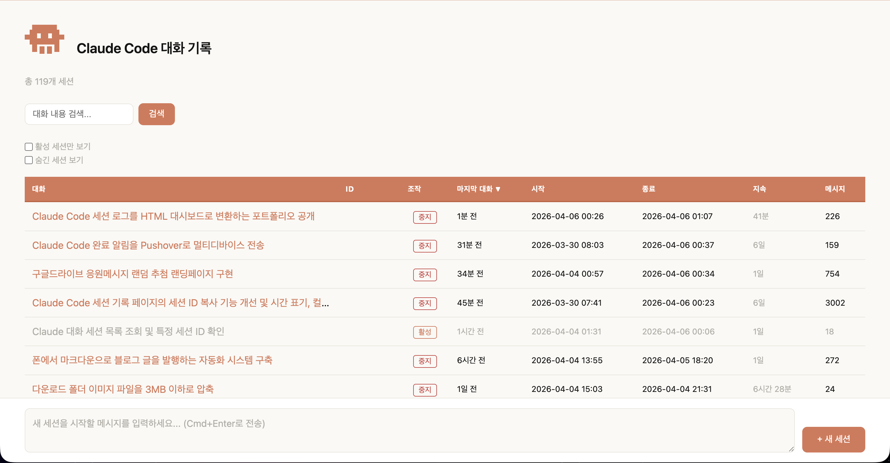
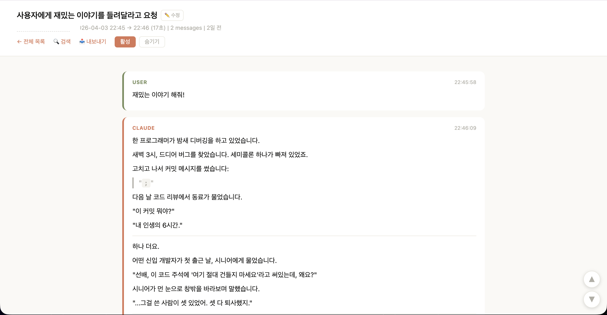
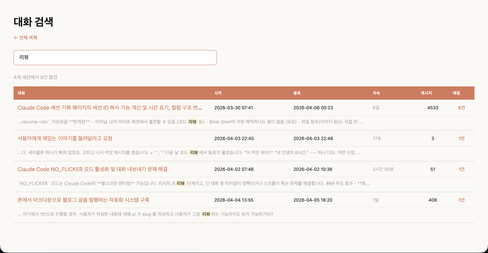
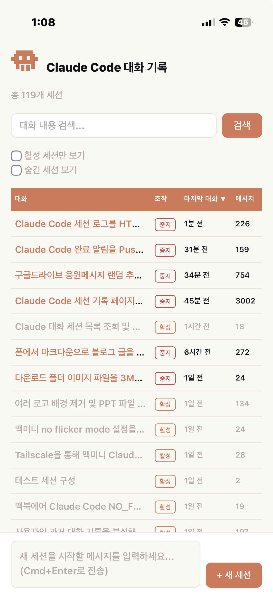
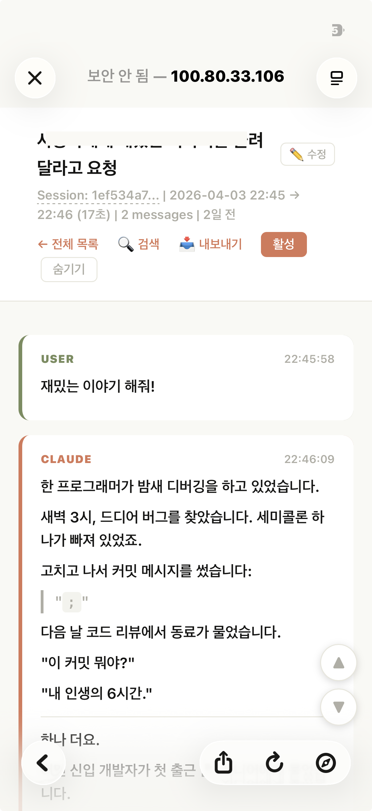
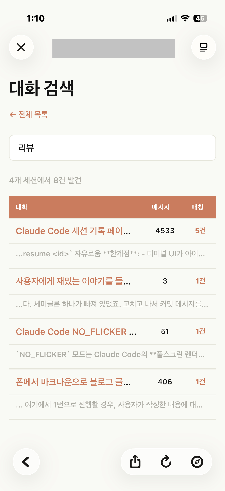

# Claude Code Session Dashboard

[한국어](README.md)

## Who this is for

- You keep a Mac Mini or desktop **always on**, running [Claude Code](https://claude.ai/code)
- You often start sessions and leave your desk
- You want to check on sessions from your **phone or laptop** while away
- You want to **kick off new tasks** on your desktop remotely

This tool assumes you have one always-connected desktop as your Claude Code machine, and you monitor and dispatch work to it from other devices while on the go. Sessions started from the dashboard automatically get the `--remote-control` flag, so you can also connect via [claude.ai/code](https://claude.ai/code) web app.

## What problem this solves

Claude Code is a terminal-based tool. When you start a session on your desktop and leave:

- **No way to check progress** — did it finish? did it error out?
- **Have to go back to the terminal** just to see the result
- Session finished? **Can't start a new one remotely**
- Hundreds of sessions piled up — **impossible to search** through JSONL files

This tool runs a web server on your desktop so you can browse and control sessions from any browser, on any device.

```
┌─────────────┐                    ┌──────────────────┐
│ On the go    │   VPN / LAN       │  Home / Office    │
│ Phone/Tablet │ ──────────────────▶│  Always-on desktop│
│ Laptop       │   Web dashboard    │  Claude Code here │
└─────────────┘                    └──────────────────┘

 ✓ Browse session conversations (markdown rendered)
 ✓ Start / stop / resume sessions
 ✓ Full-text search across all conversations
 ✓ AI-generated session titles
```

## Screenshots

### Desktop





### Mobile (iPhone)

<p float="left">
  
  
  
</p>

## Features

| Feature | Description |
|---------|-------------|
| **JSONL → HTML conversion** | Converts Claude Code session logs into markdown-rendered HTML pages |
| **Session dashboard** | Lists all sessions with titles, timestamps, duration, and message counts |
| **Full-text search** | Server-side search across all conversation history |
| **Auto-summarization** | Generates session titles using Claude Haiku API (optional) |
| **Session control** | Start, stop, and resume sessions from the web UI (macOS only) |
| **Dark mode** | Automatic light/dark theme |
| **Mobile-friendly** | Responsive layout with pull-to-refresh |
| **Export** | Download any session as a self-contained HTML file |
| **i18n** | Korean (default) and English UI |

## How is this different?

There are several great Claude Code log viewers ([clear-code](https://github.com/chatgptprojects/clear-code), [sniffly](https://github.com/chiphuyen/sniffly), [cclogviewer](https://github.com/Brads3290/cclogviewer), etc.). This project focuses on a different use case:

| | Most viewers | This project |
|---|---|---|
| **Access** | Desktop only | Phone, tablet, any browser |
| **Session control** | Read-only | Start, stop, resume from web UI |
| **Search** | Client-side or none | Server-side full-text JSONL search |
| **Titles** | Filename or first message | AI-generated summaries via Claude Haiku |
| **Multi-device** | Single machine | Primary + proxy for VPN setups |
| **Dependencies** | Node.js, Go, or npm | Python 3 stdlib only — zero dependencies |

## Quick Start

### Requirements

- **Python 3.8+** (stdlib only, no pip packages)
- **Claude Code** installed (session logs needed)
- **macOS** (for session control; viewer works on any OS)

### Install (one-time)

Just tell Claude Code:

> Clone https://github.com/sidoyu/claude-session-dashboard and run install.sh

Or manually:

```bash
git clone https://github.com/sidoyu/claude-session-dashboard.git
cd claude-session-dashboard
./install.sh
```

For English UI, create `config.json` before running install:

```bash
cp config.example.json config.json
# Edit config.json and set "lang": "en"
./install.sh
```

`install.sh` automatically:
1. Converts all Claude Code sessions to HTML
2. Registers a Claude Code Stop hook (auto-converts on session end)
3. Registers a LaunchAgent (server auto-starts on login, restarts on crash)
4. Opens `http://localhost:18080` in your browser

After installation, **nothing else to do.** The server is always running, and HTML is refreshed every time a Claude Code session ends.

### Uninstall

```bash
./uninstall.sh
```

## Configuration

### config.json

```json
{
  "port": 18080,
  "lang": "en",
  "claude_path": "~/.local/bin/claude",
  "machine_role": "auto",
  "proxy_target_ip": ""
}
```

| Field | Description | Default |
|-------|-------------|---------|
| `port` | Server port | `18080` |
| `lang` | UI language (`"ko"` or `"en"`) | `"ko"` |
| `claude_path` | Path to `claude` CLI | `~/.local/bin/claude` |
| `machine_role` | `"auto"`, `"primary"`, or `"proxy"` | `"auto"` |
| `proxy_target_ip` | Primary server IP (multi-machine only) | `""` |

### Environment variables

| Variable | Description | Default |
|----------|-------------|---------|
| `ANTHROPIC_API_KEY` | For auto-summarization (optional) | _(none)_ |
| `CLAUDE_DASHBOARD_LANG` | UI language override | `ko` |
| `CLAUDE_DASHBOARD_TZ` | Timezone offset from UTC | `9` (KST) |
| `CLAUDE_PROJECTS_DIR` | Override projects directory | _(auto-detected)_ |

### Auto-convert on session end

Add a stop hook in `~/.claude/settings.json`:

```json
{
  "hooks": {
    "Stop": [
      {
        "type": "command",
        "command": "python3 /path/to/claude-session-dashboard/convert_session.py",
        "timeout": 30
      }
    ]
  }
}
```

## How it works

```
~/.claude/projects/         convert_session.py        active_server.py
┌──────────────────┐       ┌──────────────────┐      ┌──────────────────┐
│ session-abc.jsonl │──────▶│ session-abc.html │──────▶│  localhost:18080 │
│ session-def.jsonl │──────▶│ session-def.html │      │                  │
│ ...               │       │ index.html       │      │  /active         │
└──────────────────┘       │ search.html      │      │  /search?q=      │
                            └──────────────────┘      │  /start/<sid>    │
                                                      └──────────────────┘
```

## Limitations

- **Session control is macOS-only** (AppleScript). Viewer and search work on any OS.
- **No authentication** — run on trusted networks or behind a VPN.
- **CDN dependency** — markdown rendering uses CDN. Export strips CDN for offline.
- **Single-user** — personal use, not team access.

## License

MIT
