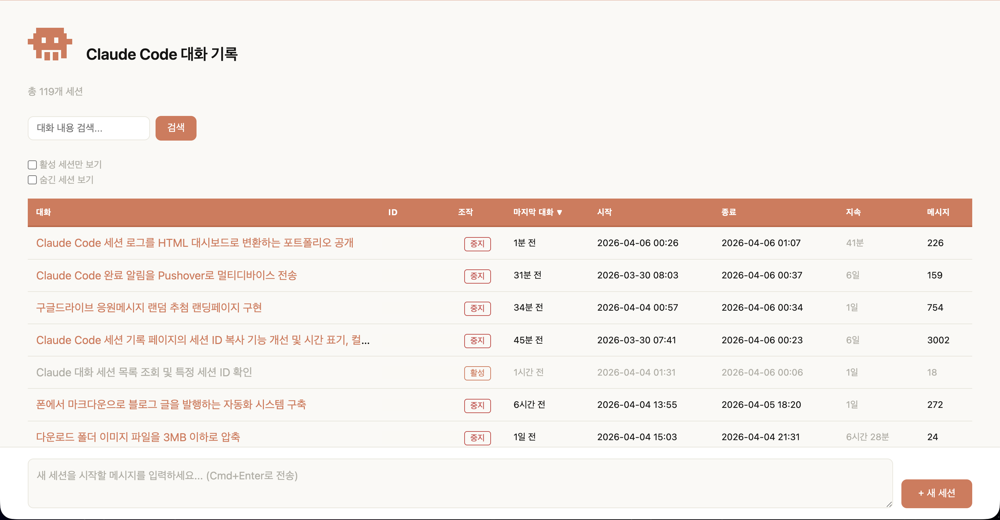
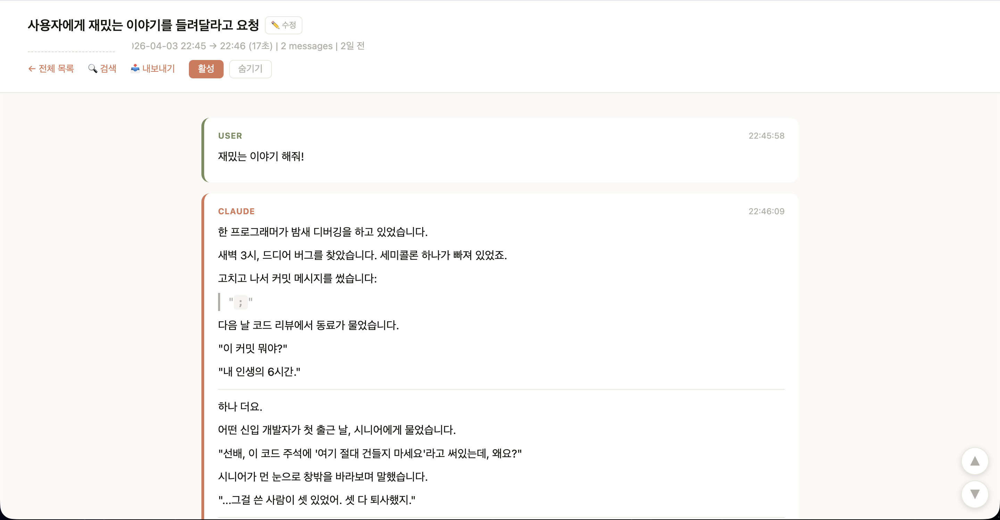
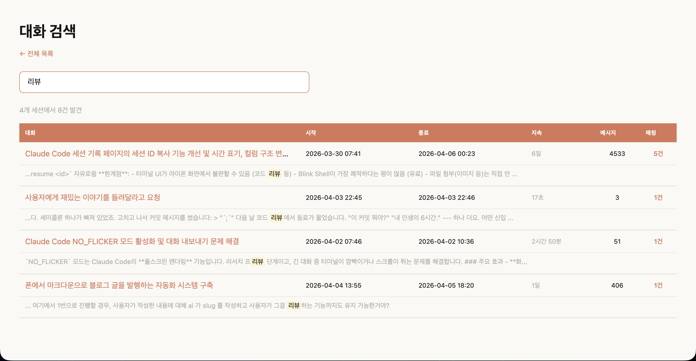
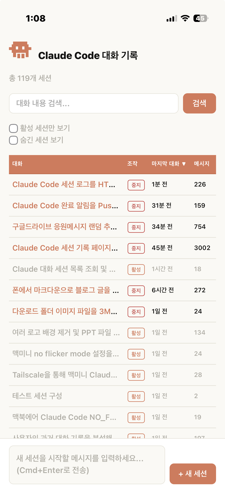
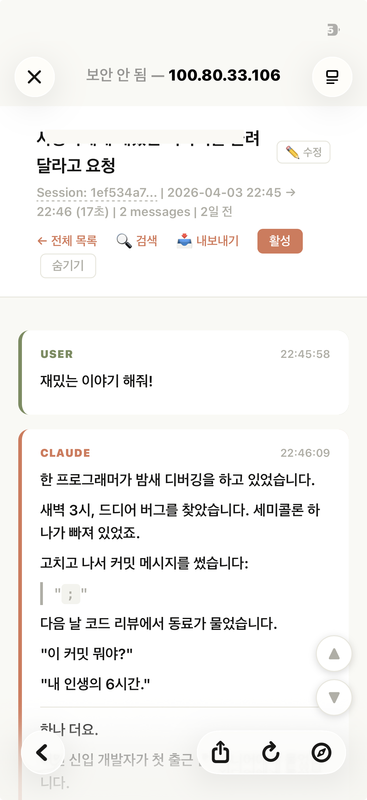
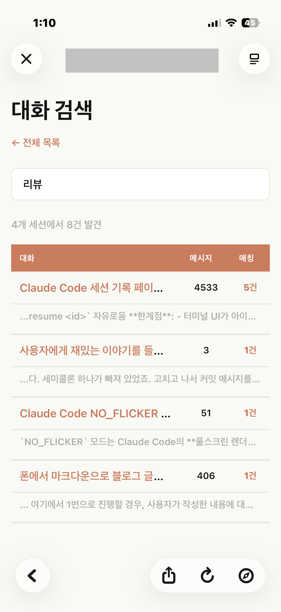

# Claude Code Session Dashboard

[한국어](README.md)

## Who this is for

- You keep a Mac Mini or desktop **always on**, running [Claude Code](https://claude.ai/code)
- You often start sessions and leave your desk
- You want to check on sessions from your **phone or laptop** while away
- You want to **kick off new tasks** or **resume existing sessions** on your desktop remotely

This tool assumes you have one always-connected desktop as your Claude Code machine, and you monitor and dispatch work to it from other devices while on the go. Sessions started or resumed from the dashboard automatically get the `--remote-control` flag, so you can connect via [claude.ai/code](https://claude.ai/code) web app.

## What problem this solves

Claude Code is a terminal-based tool. When you start a session on your desktop and leave:

- **No way to check progress** — did it finish? did it error out?
- **Have to go back to the terminal** just to see the result
- Session finished? **Can't start a new one remotely**
- Hundreds of sessions piled up — **impossible to search** through JSONL files

This tool runs a web server on your desktop so you can browse and control sessions from any browser, on any device.

```
┌─────────────┐                    ┌──────────────────┐
│ On the go    │   VPN / LAN       │  Home / Office    │
│ Phone/Tablet │ ──────────────────▶│  Always-on desktop│
│ Laptop       │   Web dashboard    │  Claude Code here │
└─────────────┘                    └──────────────────┘

 ✓ Browse session conversations (markdown rendered)
 ✓ Start new sessions / resume existing ones / stop
 ✓ Connect to resumed sessions via claude.ai/code
 ✓ Full-text search across all conversations
 ✓ AI-generated session titles
```

### How remote work flows

When you want to work with Claude Code on your desktop while away:

1. Open the dashboard (`http://desktop-ip:18080`) in your phone/tablet/laptop browser
2. Tap **"Resume"** on an existing session, or start a new one with **"+ New Session"**
3. Open [claude.ai/code](https://claude.ai/code) web app — it connects to that session (`--remote-control` is automatic)
4. Continue the conversation from the web app

> **Note:** You don't run Claude Code CLI on the remote device. All sessions run on your desktop. Remote devices connect via the **claude.ai/code web app** or **Claude app's Code feature**.

## Screenshots

### Desktop





### Mobile (iPhone)

<p float="left">
  
  
  
</p>

## Features

| Feature | Description |
|---------|-------------|
| **JSONL → HTML conversion** | Converts Claude Code session logs into markdown-rendered HTML pages |
| **Session dashboard** | Lists all sessions with titles, timestamps, duration, and message counts |
| **Full-text search** | Server-side search across all conversation history |
| **Auto-summarization** | Generates session titles using Claude Haiku API (optional) |
| **Session control** | Start, stop, and resume sessions from the web UI (macOS only) |
| **Dark mode** | Automatic light/dark theme |
| **Mobile-friendly** | Responsive layout with pull-to-refresh |
| **Export** | Download any session as a self-contained HTML file |
| **i18n** | Korean (default) and English UI |
| **Request log** | All requests logged to `active_server.log` (10MB × 5 rotation, polling endpoints excluded) — useful for incident triage |
| **New-session dedupe** | Same message within 30s reuses the first result — prevents duplicate sessions from double-tap or iOS auto-retry |
| **Auto PWA cache busting** | `convert_session.py` updates `sw.js` `CACHE_NAME` on every code change → users get the new version on next visit, no manual version bump |
| **Backup script** | `backup.sh` — weekly compressed snapshot with retention policy (registerable as a cron job) |

## How is this different?

There are several great Claude Code log viewers ([clear-code](https://github.com/chatgptprojects/clear-code), [sniffly](https://github.com/chiphuyen/sniffly), [cclogviewer](https://github.com/Brads3290/cclogviewer), etc.). This project focuses on a different use case:

| | Most viewers | This project |
|---|---|---|
| **Access** | Desktop only | Phone, tablet, any browser |
| **Session control** | Read-only | Start, stop, resume from web UI |
| **Search** | Client-side or none | Server-side full-text JSONL search |
| **Titles** | Filename or first message | AI-generated summaries via Claude Haiku |
| **Multi-device** | Single machine | Primary + proxy for VPN setups |
| **Dependencies** | Node.js, Go, or npm | Python 3 stdlib only — zero dependencies |

## Quick Start

### Requirements

- **Python 3.8+** (stdlib only, no pip packages)
- **Claude Code** installed (session logs needed)
- **macOS** (for session control; viewer works on any OS)

### Install (one-time)

Just tell Claude Code:

> Clone https://github.com/sidoyu/claude-session-dashboard and run `./install.sh --auto`

Or run it yourself for interactive setup (API key, trust dialog, etc.):

```bash
git clone https://github.com/sidoyu/claude-session-dashboard.git
cd claude-session-dashboard
./install.sh
```

| Mode | Command | Use case |
|------|---------|----------|
| **Interactive** | `./install.sh` | Run it yourself. Configure API key, trust dialog step by step |
| **Auto** | `./install.sh --auto` | Claude Code runs it. Uses defaults, no prompts |

For English UI, create `config.json` before running install:

```bash
cp config.example.json config.json
# Edit config.json and set "lang": "en"
./install.sh
```

`install.sh` automatically:
1. Converts all Claude Code sessions to HTML
2. Registers a Claude Code Stop hook (auto-converts on session end)
3. Registers a LaunchAgent (server auto-starts on login, restarts on crash)
4. Opens `http://localhost:18080` in your browser

After installation, **nothing else to do.** The server is always running, and HTML is refreshed every time a Claude Code session ends.

### Uninstall

```bash
./uninstall.sh
```

## Configuration

### config.json

```json
{
  "port": 18080,
  "lang": "en",
  "claude_path": "~/.local/bin/claude",
  "machine_role": "auto",
  "proxy_target_ip": ""
}
```

| Field | Description | Default |
|-------|-------------|---------|
| `port` | Server port | `18080` |
| `lang` | UI language (`"ko"` or `"en"`) | `"ko"` |
| `claude_path` | Path to `claude` CLI | `~/.local/bin/claude` |
| `machine_role` | `"auto"`, `"primary"`, or `"proxy"` | `"auto"` |
| `proxy_target_ip` | Primary server IP (multi-machine only) | `""` |

### Environment variables

| Variable | Description | Default |
|----------|-------------|---------|
| `ANTHROPIC_API_KEY` | For auto-summarization (optional) | _(none)_ |
| `CLAUDE_DASHBOARD_LANG` | UI language override | `ko` |
| `CLAUDE_DASHBOARD_TZ` | Timezone offset from UTC | `9` (KST) |
| `CLAUDE_PROJECTS_DIR` | Override projects directory | _(auto-detected)_ |

### Multi-machine setup (advanced)

For multiple Macs connected via Tailscale or another VPN:

1. **Primary machine** (where Claude Code runs): use the default config.
2. **Secondary machine**: set in `config.json`:

```json
{
  "machine_role": "proxy",
  "proxy_target_ip": "100.x.x.x"
}
```

The secondary machine then forwards all requests to the primary.

> Note: a proxy machine is essentially "secondary browser → primary IP" automated. You can also just open `http://100.x.x.x:18080/` directly from the secondary machine's browser and skip the proxy entirely. Use the proxy only when you want LaunchAgent auto-start, a `localhost` bookmark, or other local conveniences.

### HTTPS

This server is intentionally HTTP. Tailscale provides end-to-end WireGuard encryption, and the IPs are mesh-private (unreachable from the public internet), so adding TLS provides little extra value. If you need a real certificate, use `tailscale cert` + Let's Encrypt.

### Backups

Register `backup.sh` in cron for weekly snapshots:

```cron
0 3 * * 0  /path/to/dashboard/backup.sh
```

Default destination: `~/Backups/claude-dashboard/` with 8-week retention. Override via `BACKUP_DEST` and `RETENTION` environment variables.

### Auto-convert on session end

Add a stop hook in `~/.claude/settings.json`:

```json
{
  "hooks": {
    "Stop": [
      {
        "type": "command",
        "command": "python3 /path/to/claude-session-dashboard/convert_session.py",
        "timeout": 30
      }
    ]
  }
}
```

## How it works

```
~/.claude/projects/         convert_session.py        active_server.py
┌──────────────────┐       ┌──────────────────┐      ┌──────────────────┐
│ session-abc.jsonl │──────▶│ session-abc.html │──────▶│  localhost:18080 │
│ session-def.jsonl │──────▶│ session-def.html │      │                  │
│ ...               │       │ index.html       │      │  /active         │
└──────────────────┘       │ search.html      │      │  /search?q=      │
                            └──────────────────┘      │  /start/<sid>    │
                                                      └──────────────────┘
```

## Limitations

- **Session control is macOS-only** (AppleScript). Viewer and search work on any OS.
- **No authentication** — run on trusted networks or behind a VPN.
- **CDN dependency** — markdown rendering uses CDN. Export strips CDN for offline.
- **Single-user** — personal use, not team access.
- **180-second timeout for new sessions** — When starting a new session from the dashboard, the server waits synchronously for the first prompt to complete, with a 180-second (3-minute) timeout. Start remote sessions with a simple greeting like `"hi"` first, then connect via the [claude.ai/code](https://claude.ai/code) web app to continue with your actual task.
- **OAuth token expiration** — Claude Code authenticates via an OAuth token issued by `/login`, which expires after a certain period. When it expires, all sessions will simultaneously show `401 authentication_error`, and you must run `/login` again directly on the desktop. Re-login cannot be done remotely, so physical access to the desktop is required.

## License

MIT
